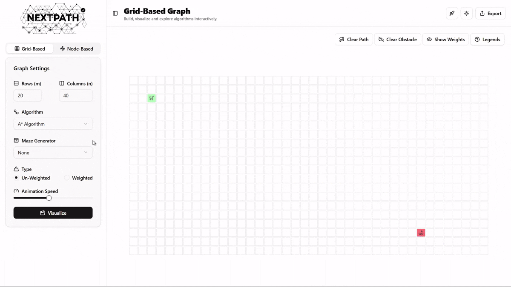
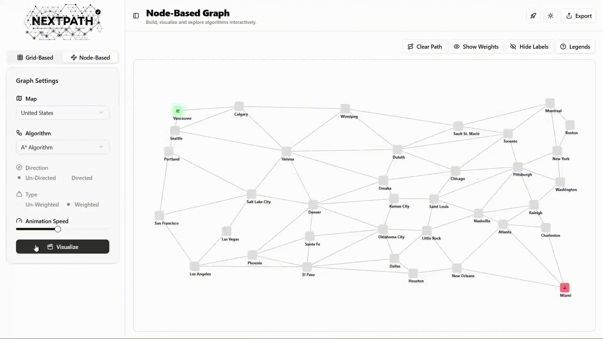

# ⚡️ NextPath – Your Ultimate Graph Algorithm Playground

> Built with ⚙️ **Next.js 15** · 🧠 **React Flow** · 🎯 **TypeScript** · 🎨 **Tailwind CSS v4**

Welcome to **NextPath**, the **developer-first graph algorithm visualizer** that’s anything but ordinary. This isn’t just a tool—it’s a **real-time, interactive graph engine** designed to help you **simulate, test, and master graph algorithms** with unparalleled clarity. Whether you’re debugging A*, exploring BFS, or crafting custom graphs, NextPath turns theory into an **intuitive, hands-on experience**.

🌟 **Try it live** → [nextpath-algo.vercel.app](https://nextpath-algo.vercel.app)

---

## 🎥 Sneak Peek

| **Grid Mode** | **Network Mode** |
|---------------|------------------|
|  |  |
| *A* blazing through an interactive grid with island terrain* | *Traversing the USA map from Vancouver to Miami with A** |

---

## 🔥 Why NextPath Rocks

Forget static diagrams and boring textbooks. NextPath is your playground for graph algorithms, packed with features to spark your curiosity:

- 🏗️ **Build graphs your way**: Drag, drop, and connect nodes with precision.
- 🔄 **Grid or network? You choose**: Seamlessly switch modes to match your vibe.
- 🎬 **Watch algorithms come alive**: Visualize A*, Dijkstra, BFS, and DFS with smooth animations.
- 🌍 **Real-world templates**: Experiment with USA maps or custom regions.
- 🌊 **Organic terrain generation**: Create solvable mazes with island-style walls.
- 🌗 **Light or dark mode**: Customize themes, speed, weights, and directions.
- 🔗 **Share your creations**: Export and collaborate with stateful URLs.

Built for **performance, extensibility, and a slick UX**, NextPath is your go-to for mastering graphs.

---

## 🛠️ Engineered for Devs, Not Just Learners

**Tech stack that packs a punch:**

| Layer | Tech |
|-------|------|
| **Framework** | [Next.js 15 App Router](https://nextjs.org/) |
| **UI** | [React Flow](https://reactflow.dev/), Tailwind CSS v4, Framer Motion |
| **State** | Zustand |
| **Typing** | TypeScript |
| **Hosting** | Vercel |

> This isn’t a toy—it’s a **modular, scalable system** ready for your wildest graph experiments.

---

## 🧮 Algorithms That Shine

NextPath brings classic algorithms to life with vibrant visualizations:

| Algorithm | Mode | Weighted | Directed |
|-----------|------|----------|----------|
| **A*** | Grid + Network | ✅ | ✅ |
| **Dijkstra** | Grid + Network | ✅ | ✅ |
| **BFS** | Grid + Network | ❌ | ✅ |
| **DFS** | Grid + Network | ❌ | ✅ |

🚀 **Coming soon**: Floyd-Warshall, Bellman-Ford, Topological Sort, Kruskal’s, and more!

---

## ⚡ Power Features for Devs

- 🎥 **Real-time animations**: Control traversal speed for crystal-clear insights.
- 🧱 **Smart terrain generation**: Walls and mazes that always guarantee a solution.
- 🌐 **Flexible graph types**: Freeform, grid-based, or location-driven maps.
- 🧮 **Customizable graphs**: Tweak weights, directions, and adjacency models.
- 🔄 **Share instantly**: Serialize graphs into URLs for easy collaboration.


🔗 Open `http://localhost:3000` and start exploring!

---

## 🌟 What’s Next for NextPath?

We’re just getting started! Here’s what’s on the horizon:

- ⛓️ **Full weighted directed graph support** for all algorithms.
- 🧠 **AI-powered hints** to guide you through algorithms step-by-step.
- 📦 **JSON exports** for real-world datasets.
- 🧭 **New algorithms**: Floyd-Warshall, Bellman-Ford, Prim, Kruskal.
- 📱 **Mobile app + PWA** for on-the-go graph fun.

---

## 👨‍💻 Meet the Creator

**[Lakshman Siva](https://lakshman-io.vercel.app/)** – Full-stack engineer, ML enthusiast, and visualization nerd.  
🔗 [GitHub](https://github.com/Lakshman-99) | [LinkedIn](https://linkedin.com/in/lakshman18)

---

## 🤝 Join the Fun

Got a killer algorithm, UI tweak, or new feature in mind? Contribute to NextPath!

```bash
git checkout -b feature/epic-idea
```

Submit a PR and become a **NextPath legend**. Have suggestions? [Open an issue](https://github.com/Lakshman-99/nextpath/issues).

---

## 📜 License

**Creative Commons Attribution-NonCommercial 4.0 International (CC BY-NC 4.0)**  
✅ Use, remix, and build upon NextPath for **non-commercial projects** with proper credit.  
❌ Commercial use requires explicit permission.  

Details → [creativecommons.org/licenses/by-nc/4.0/](https://creativecommons.org/licenses/by-nc/4.0/)

---

> **NextPath**: Where graphs meet creativity. Built for devs, by devs. Let’s explore the path ahead together! 🚀